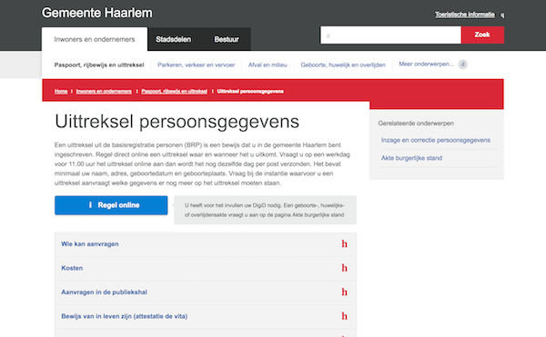

# ClaimPage

A webserver that hosts the web-page where citizens can download their [Verifiable Claim](../docs/scenario.md) PDF.

The design and most page elements are copied from the website of the [Gemeente Haarlem](https://www.haarlem.nl/inwoners-en-ondernemers/).



## Build Setup

``` bash
# install dependencies
npm install

# serve with hot reload at localhost:8080
npm run dev

# build for production with minification
npm run build

# build for production and view the bundle analyzer report
npm run build --report

# run unit tests
npm run unit

# run all tests
npm test
```

For a detailed explanation on how things work, check out the [guide](http://vuejs-templates.github.io/webpack/) and [docs for vue-loader](http://vuejs.github.io/vue-loader).
