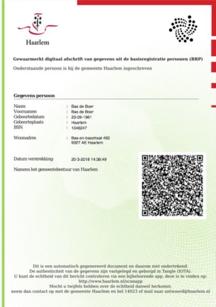

# Scenario: Digital 'proof of registration' for housing cooperative registration

Currently the process for a citizen is:

1. A citizen can request a 'proof of registration' online or at city hall.
2. The citizen will have to go to city hall to identify themselves, pay €25 in fees and receive the paper document.
3. The citizen has to mail the document to the housing cooperative.

This [proof of concept](proof-of-concept.md) fulfills the following scenario:

1. A _Citizen_ retreives a digital 'proof of registration' on the _Public Administration_ website as a _Claim_.
2. The _Citizen_ provides this claim to the _Housing Cooperative_ when they register for social housing.
3. The _Housing Cooperative_ verifies this claim with the _Attestations_.

## 0. The Housing Cooperative subscribes to the MAM channel of the Public Administration

In order to verify claims the Housing Cooperative needs access to the [MAM channel](technologies.md#mam-channels) where the attestations will be posted. The Public Administration is the only party that can post on this MAM channel.

For security reasons access to this channel might be limited to trusted parties. In that case the Housing Cooperative will have to identify itself in a secured session through a website or application. However in this proof on concept the MAM channel is public.

The subscription can also happen at a later moment in time.

In this proof of concept the MAM channel is done by the [ClaimServer](../ClaimServer/README.md) component.

## 1. The Citizen retrieves the digital 'proof of registration'

In order to retrieve a digital 'proof of registration' the Citizen can use the website of the Public Administration.

In this proof of concept the Public Administration server side work is done by the [ClaimServer](../ClaimServer/README.md) component and the Citizen client side webpage is served by the [ClaimPage](../ClaimPage/README.md) component.

### a. Retrieving the information from the Public Administration

On the website of the Public Administration the Citizen can authenticate using a trusted authentication method (like DigiD in the Netherlands, GOV.UK Verify in the UK or login.gov in the US) and requests a 'proof of registration'. (This step has been omitted in this proof of Concept, and just an example file will be given.)

The Public Administration will now get the information it needs for the 'proof of registration' from the civil registries and provides this to the Citizen's computer in a linked data JSON-LD format.

### b. Citizen creating the claim and the Public Administration creating the attestation

The Citizen's computer locally verifies the information to be correct and doing so adds a secret code.

The Public Administration publishes a hash (derivative that can only be created and verified, not reverse engineered) of the information and the secret on the MAM channel as an attestation. This means the actual information is not readable for those subscribed. A reference to this message together with the information and secret – the claim – is rendered in a digital 'proof of registration'. The Citizen can later use this to verify the claim.

The digital 'proof of registration' is, in this proof of concept, a PDF or a printed sheet with a QR code that holds the claim.

## 2. Verification

The Citizen can now go to the Housing Cooperative and provide them, either in paper or digitally, with the digital 'proof of registration'.

The verification tool can read the digital 'proof of registration' and craws the MAM channel untill the claim is found. The verification tool now tests whether the hash provided by the Citizen equals the hash provided by the Public Administration on the MAM channel.

The fact the hash of the information and secret exists in the channel in which only the Public Administration can add messages to proves that the Public Administration earlier identified a person with the same information and knowledge of the same secret as provided by the person now in contact with the Housing Cooperative.

In this proof of concept the verification tool is a [QR Scanner web-app](../Scanner/README.md) component.
